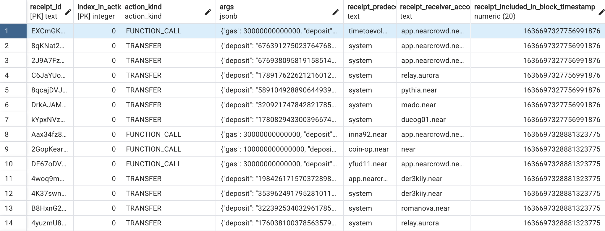

```{r setup, include=FALSE}
knitr::opts_chunk$set(echo = TRUE)
```

Kirill Makarov & Jenna Prades  
  


  
  
  
  
# Tradestats 

## Présentation du jeu de données  

Le jeu de données provient lui même de la blockchain et a été extrait de la bourse afin que les données soient le plus fiables et proches de la réalité possibles.  

# Preparation:

## PART 1 - Where to search for variables and values on the blockchain?

The first and maybe the hardest thing to do is to understand, what happens on the blockchain when you swap 
your tokens on different exchanges. The easiest way is to execute some swaps and just look
inside the transactions. Let's start with [REF finance](https://app.ref.finance/).

### Each transaction has its execution plan. 
There are some examples:


- swapping 1 REF token for USDC:
[example 1](https://explorer.mainnet.near.org/transactions/BcR6ez3uYh54poqZwLMMgVKcqzMrz7Kn1C455dAiwVno)

- swapping 0.1234 USDT for Skyward:
[example 2](https://explorer.mainnet.near.org/transactions/F95qeUybVWyYS6WgjuDvyJF1kotYS2V5SThV5JJWui94)

- swapping 0.1 NEAR for DAI:
[example 3](https://explorer.mainnet.near.org/transactions/F9g7zrJj2agu5PsVdabpYqka57oFawV9JXSi5pvtv72C)

#### Let me translate to you what's going on here.

As we can see the whole execution is divided by small parts called "receipts", like this one (from the first example):


For each receipt like this we have the information about execution block, burned gas etc., but what's really
important for our case in this transaction is:
- contract name
- method name
- arguments:
  - receiver id
  - amount

Despite the swap is executed using multiple pools and difficult routing we can still extract all needed data from the 
transaction.

Each time we do a swap on this platform, we can find the following receipt in the execution plan:


So, from this receipt we can find the information we need (underlined):
- operation name
- DEX name (contract name)
- amount_in
- token_in (from args.msg)
- token_out (from args.msg)

To summarize, looking for the receipts like this we can make sure this is a swap operation with a certain volume on
a specific platform. Great! let's query the blockchain for the receipts we need!


## PART 2: Querying the blockchain.

Ok, we need to get all the receipts with a specific structure.

Instead of searching for these receipts on the blockchain directly, we can use a
centralized indexer (data collector for the blockchain)
to extract it.
To perform this research I had to use the NEAR mainnet database (open to use, credentials are inside):
https://github.com/near/near-indexer-for-explorer

## the database structure:


What I am searching for is in action_receipt_actions table of this database.

Let's query on last 1000 entries of this table: 

```sql
select * from action_receipt_actions limit 1000;
```

output: 




What can we do with all this data? We can take **all** the receipts of the blockchain (we can explore ALL OF THEM),
then filter them like: 
- receipt_receiver_account_id == v2.ref-finance.near
- called method == ft_on_transfer
- action_kind == FUNCTION_CALL (to get only smart contract method calls)

We can apply some filters in the SQL directly

Let's query the database to get some smart contract calls, convert it to CSV and proceed to the data filtering in Python.

```postgresql
select receipt_id, args, receipt_receiver_account_id, receipt_included_in_block_timestamp
from action_receipt_actions
where action_kind = 'FUNCTION_CALL' and
receipt_receiver_account_id = 'v2.ref-finance.near'
limit 10000
```

Let's then filter the entries by the method name and check what's inside:

```Python
import csv
import json


datafile = open('query-10000.csv', 'r')
reader = csv.reader(datafile)
headers = next(reader)

ref_swaps = []

for raw in reader:
    json_args = raw[1]
    args = json.loads(json_args)
    method_name = args['method_name']
    if method_name == 'ft_on_transfer':
        ref_swaps.append(raw)

[print(swap) for swap in ref_swaps]
```

```Python
# part of the output:
['WQ5cPKRbW9unxVgFtLni4pdah91zz7TATcAtqrahHP3', '{"gas": 150000000000000, "deposit": "0", "args_json": {"msg": "{\\\\\\"force\\\\\\":0,\\\\\\"actions\\\\\\":[{\\\\\\"pool_id\\\...
['4Kp1YLPne5Ng8nQ3HDZRyEDyzSuw1SXZZTL2LyVBWTzc', '{"gas": 150000000000000, "deposit": "0", "args_json": {"msg": "{\\\\\\"force\\\\\\":0,\\\\\\"actions\\\\\\":[{\\\\\\"pool_id\\...
['44aV32BMt2MMwAueEd2e1QaXcz2FxV3TmtR3EYri49qW', '{"gas": 220000000000000, "deposit": "0", "args_json": {"msg": "{\\\\\\"referral_id\\\\\\":\\\\\\"skyward-ref.near\\\\\\",\\\\\...
['5spKFSJqmu3srs99N7CoQvqoGtAXcr4WDwaX9MgpRm8v', '{"gas": 70000000000000, "deposit": "0", "args_json": {"msg": "", "amount": "28437322357073520000", "sender_id": "eypo.near"}, ...
```

As you can see, we have different messages in arguments with the same method call. From time to time there 
is no message in the args. Let's check what is happening in the explorer for these receipts:

- when there is no message, this is the deposit to the platform (no tokens swapped) 
[transaction](https://explorer.mainnet.near.org/transactions/DDfhGh2MwkHBLBqCGDcc3AUqqZuSp7YnKP1gj9eKdvQ9#5spKFSJqmu3srs99N7CoQvqoGtAXcr4WDwaX9MgpRm8v)
- when there is a message, it's a swap
[transaction](https://explorer.mainnet.near.org/transactions/235vZat262EeqBEPPFW5q32YLHxJBLLxWAdPGTZD1LJT#44aV32BMt2MMwAueEd2e1QaXcz2FxV3TmtR3EYri49qW)

We can prove it by looking inside their smart contracts' code:

https://github.com/ref-finance/ref-contracts/blob/c580d8742d80033a630a393180163ab70f9f3c94/ref-exchange/src/token_receiver.rs

here in ft_on_transfer declaration you can find:
```Rust
#[near_bindgen]
impl FungibleTokenReceiver for Contract {
    #[allow(unreachable_code)]
    fn ft_on_transfer(
        ...
        if msg.is_empty() {
            // Simple deposit.
            self.internal_deposit(sender_id.as_ref(), &token_in, amount.into());
            PromiseOrValue::Value(U128(0))
        } else {
            // instant swap
            let message =
                serde_json::from_str::<TokenReceiverMessage>(&msg).expect(ERR28_WRONG_MSG_FORMAT);
            ...
            }
        }
    }
}
```

So, we're sure that these method calls with a message are definitely swap operations.

Let's query more receipts I limited the query to 100K entries, filter them by argument.msg and proceed
to the next data transformation. It would be cool to use a notebook (Jupyter or google collab), but I will
use classic python files because I'm more used to work like this.

So, the final version of the extraction file looks like this

```Python
import csv
import json
import datetime

# opening files for reading and writing
datafile = open('query-100k.csv', 'r')
export = open('ref-swaps.csv', 'w')

# taking headers from the initial file and copying them to the export file
reader = csv.reader(datafile)
writer = csv.writer(export)
headers = next(reader)
writer.writerow(headers)


ref_swaps = []

# checking if a receipt has the attributes of a swap on REF. If it's the case, adding it to the export
for raw in reader:
    json_args = raw[1]
    args = json.loads(json_args)
    method_name = args['method_name']
    msg = args['args_json'].get('msg')
    if method_name != 'ft_on_transfer':
        continue
    if not msg:
        continue
    writer.writerow(raw)
    ref_swaps.append(raw)


datafile.close()
export.close()

ts = datetime.datetime.fromtimestamp(float(ref_swaps[0][3][:10]))
te = datetime.datetime.fromtimestamp(float(ref_swaps[-1][3][:10]))

print(f"{len(ref_swaps)} swaps found for the last {abs(te-ts)}")
```

Output:

```
21093 swaps found for the last 8 days, 20:55:02
```

Ok, 21K entries collected during a week is enough for the analysis, let's make some transformations to this data

I want to create a kind of database with these variables:
- receipt_id
- token_in_name
- token_out_name
- swap_volume_usd
- transaction_signer (user who executed the swap)
- exchange_name
- exchange_type
- exchange_timestamp


let's do it in Python as well:

Firstly, we need a database containing token prices in USD at a special timestamp,
so we could compare different swap operations in volume.

The amount_in is given with different decimals e.g.

```
1000000000000000000 = 1 NEAR
1000000 = 1 USN
```


meaning that every time we want to use the amount_in, we have to divide it by token's number of decimals.
In order to get the token's price we will use the API of coingecko: [reference](https://www.coingecko.com/en/api/documentation),
but to make requests on its endpoints, we need a token id on coingecko, while we only have the addresses 


Let's do a small plan of the token data transformation:
- get all the token_in addresses from swaps
- with the NEAR API, get their decimals and symbols
- with their symbols, get their id on coingecko
- get all the days mentioned in swaps (from the timestamp)
- get the token prices for each day
- export in csv containing
  - USD price for one token
  - token id on Coingecko
  - token address on NEAR blockchain
  - number of decimals
  - day

```Python
import requests
import json
import csv
import datetime
import time

# creating a new file for export
export_file = open('tokens-prices.csv', 'w')
tokens_prices = csv.writer(export_file)


def dict_from(message: str) -> dict:
    """
    :param message:
    :return: a dict generated from the str-formatted message from the transaction
    """
    message = message.replace(r'\"', '"')
    return json.loads(message)


def token_in_address_from_message(message: dict):
    # to get the token_in address, we have to look inside the FIRST action
    action = message['actions'][0]
    token_in_address = action['token_in']
    return token_in_address


receipts = open('ref-swaps.csv', 'r')
swap_receipts = csv.reader(receipts)
headers = next(swap_receipts)

unique_days = set()
unique_token_addresses = set()

# from each swap-receipt, we extract the date of the transaction and the data about the token in
for receipt in swap_receipts:
    args = json.loads(receipt[1])
    msg = dict_from(args['args_json']['msg'])
    token_in = token_in_address_from_message(msg)
    timestamp = receipt[-1]
    day = datetime.datetime.fromtimestamp(float(timestamp[:10])).date()
    unique_days.add(day.strftime('%d-%m-%y'))
    unique_token_addresses.add(token_in)


# get all tokens with data available on Coingecko
coin_list = requests.get('https://api.coingecko.com/api/v3/coins/list').json()


# requesting the data from ref finance api
# that will allow to join the token address, its symbol and the number of decimals
near_coins = requests.get('https://api.stats.ref.finance/api/ft').json()

token_data = []
# joining the token address, number of decimals, its id on Coingecko if the token is present there
for address in unique_token_addresses:
    token_symbol = None
    token_decimals = None
    token_id = None
    for coin in near_coins:
        if coin['token_account_id'] == address:
            token_symbol = coin['symbol']
            token_decimals = coin['decimals']
    for available_coin in coin_list:
        if available_coin['symbol'].lower() == token_symbol.lower():
            token_id = available_coin['id']

    if token_symbol is None or token_id is None or token_decimals is None:
        continue

    token_data.append({
        'id': token_id,
        'address': address,
        'decimals': token_decimals
    })

# variable names we are going to have in the export
export_headers = [
    'price_usd',
    'token_address',
    'token_id_coingecko',
    'decimals',
    'day'
]

tokens_prices.writerow(export_headers)

# requesting the Coingecko api to get the price data for each token for each day
# time.sleep() to avoid exceeding the api limits
for token in token_data:
    for day in unique_days:
        day = day.replace('-22', '-2022')
        time.sleep(2)
        history = requests.get(
            f'https://api.coingecko.com/api/v3/coins/{token["id"]}/history?date={day}'
        ).json()
        # if we get all the data we need from the request, adding the token data to export
        if history.get('market_data'):
            market_data = history['market_data']
            if market_data.get('current_price'):
                current_price = market_data['current_price']
                if current_price.get('usd'):
                    usd_price = current_price['usd']
                    row = [
                        usd_price,
                        token["address"],
                        token["id"],
                        token["decimals"],
                        day
                    ]
                    tokens_prices.writerow(row)

export_file.close()
receipts.close()
```
It took a while for the code to be completely executed. 
In the output we have a csv with the rows like: 
```
4.230179413175076,wrap.near,wrapped-near,24,22-08-2022
3.9259317414571497,wrap.near,wrapped-near,24,28-08-2022
3.926304977252688,wrap.near,wrapped-near,24,27-08-2022
```


### Le MCD

| Symbols        |
|:--------------:|
| symbol         |
| *token_address*|
|decimals        |

| Prices      |
|:-----------:|
| price_usd   |
| *token_id_* |
|decimals     |
|day          |

| Token        |
|:------------:|
| *token_id*   |
| symbol       |

| Transactions     |
|:----------------:|
| *receipt_id*     |
| token_in_address |
|amount_in         |
|day               |
|token_out_address |
|transaction_signer|

Pour réaliser l'analyse et répondre à la problématique posée, nous disposons des 4 fichiers précédents dans lesquels nous avons réalisé des jointures.  

```{r}
data <- read.csv("C:/Users/6prad/Desktop/projet/shiny_analysis/data/final/swap_operations.csv")
```
### Le nom des colonnes  

```{r}
colnames(data)
```

### Voici le résumé des données :  

```{r}
summary(data)
```

Chaque colonne correspond à une donnée :

•	receipt_id -> id de receipt (action dans de transaction)  
•	token_in_name -> nom du token qu'on vend
•	token_out_name ->  nom du token qu'on achete
•	token_in_price -> prix d'un token de vente
•	token_out_price -> prix d'un token d'achat
•	swap_volume_USD -> volume echangé en USD 
•	transaction_signer -> nom de la personne qui a signé la transaction  
•	exchange_name -> nom du plateforme d'echange
•	exchange_type ->  type du plateforme d'echange
•	exchange_timestamp -> moment d'execution de la transaction

## Le projet  

Le projet Tradestats consiste en la realisation d'une application R Shiny qui sera par la suite publiee et donc accessible sur internet via Shinyapps.io.  
Nous avons réalisé plusieurs documents pour répondre au sujet, nous pouvons trouver sur GitHub (espace de partage de documents) un document qui explique comment a été réalisé le projet, avec les spécifications techniques, le fichier brut contenant le code créant l'application Shiny, un Document R.Markdown retracant la source de données, les informations présentes dans le jeu de données, quelques indicateurs statistiques et plusieurs graphiques présents dans l'application. Tout ceci dans l'objectif de répondre a la problématique posée.

### La problematique  

Nous avons decide de centrer notre projet sur l'etude de la blockchain, les transactions associees a ces echanges et les traders concernes.  
C'est pourquoi nous avons decide de poser la problematique suivante  
Quelles sont les habitudes des traders sur la blockchain ?  
Pour mieux comprendre le comportement des personnes sur la bourse et voir s'il y a un modele particulier utilise par les traders ou des transactions phares.  
Pour repondre a cette question, nous avons developpe une application R Shiny basee sur des donnees extraites elles-memes de la blockchain.  

### Qu'est ce que la blockchain  

La blockchain permet de stocker et d’échanger de la valeur, comme des cryptomonnaies, sur internet sans intermédiaire centralisé. Une blockchain constitue une base de données qui contient l’historique de tous les échanges effectués entre ses utilisateurs depuis sa création de manière sécurisée, indestructible, impossible à effacer.  

## Exploration des données  

### Analyse du volume

```{r}
summary(data$volume)
sd(data$volume)
```

```{r}
library(ggplot2)
ggplot(data) +
 aes(x = day) +
 geom_bar(fill = "#112446") +
 theme_minimal()
```

Nous voyons que le 23 et le 26 admettent bien plus de transactions que pour les autres jours étudiés. Cela peut concevoir une certaine recurrence sur les échanges.  

Nous allons comparer le nombre de transaction faites par jour avec le volume échangé pour voir si le jour influe sur le volume.  

```{r}
library(ggplot2)
ggplot(data) +
  aes(x = day, y = volume) +
  geom_col(fill = "#112446") +
  theme_minimal()
```

|   Jour   |Nb transaction|Volume |volume moyen/transaction|
|:--------:|:--------:|:--------:|:--------:|
|21-08-2022| 954|520655.2265 |545.76 |
|22-08-2022| 2508| 1137033.851|453.36 |
|23-08-2022| 2963| 1719790.877|580.42 |
|24-08-2022| 1986| 964743.6164|485.77 |
|25-08-2022| 1879| 712603.0258|379.25 |
|26-08-2022| 3050|1422342.949 |466.34 |
|27-08-2022| 2049| 907148.4622|442.73 |
|28-08-2022| 1455|541152.9405 |371.93 |
|29-08-2022| 2181|1381254.213 |633.31 |
|30-08-2022| 948| 437423.6403|461.42 |

Nous pouvons voir du tableau précedent que le volume transité diffère en fonction du jour des transactions. Ainsi, le 29-08-2022 le volume moyen d'une transaction était supérieur aux autres jours étudiés, contre 371.93 le 28 soit la veille. C'est une autre remarque que l'on peut se faire pour répondre à la problématique.  

### Analyse des prix

```{r}
summary(data$price_usd)
sd(data$price_usd)
```

```{r}
library(ggplot2)
ggplot(data) +
  aes(x = day, y = price_usd) +
  geom_col(fill = "#112446") +
  theme_minimal()
```

|   Jour   |Nb transaction|Prix |Prix moyen/transaction|
|:--------:|:--------:|:--------:|:--------:|
|21-08-2022| 954|1063987.538 | 1115.29|
|22-08-2022| 2508| 2752833.845|1097.62 |
|23-08-2022| 2963|3349371.255 |1130.40 |
|24-08-2022| 1986|1745682.067 |878.99 |
|25-08-2022| 1879| 664875.9235|353.85 |
|26-08-2022| 3050|3610782.236 |1183.86 |
|27-08-2022| 2049| 740136.7879|361.22 |
|28-08-2022| 1455| 887732.028|610.13 |
|29-08-2022| 2181| 2101249.302|963.43 |
|30-08-2022| 948| 2285533.305|2410.90 |

D'après les graphiques précédents et les tableaux de données, nous pouvons en analyser que les plus grands prix pour une transaction ont eut lieu le 30-08-2022, avec un prix moyen de 2410.90 pour cette journée contre 353.85 le 25-08-2022, ce qui marque une première conclusion et habitude.   

### Analyse des montants  

```{r}
summary(data$amount_in)
sd(data$amount_in)
```

Nous admettons une grande différence entre le montant minimum et maximum échangé. Cela nous montre et nous fait déduire que le montant varie beaucoup ne me peut être considéré comme une habitude réelle de la part des traders.  

### Analyse des traders  

```{r}
library(ggplot2)
ggplot(data) +
 aes(x = day, y = token_in_id, group = day) +
 geom_tile(size = 1.2) +
 theme_minimal()
```

Ce graphique nous montre qu'un grand nombre de traders effectuent des échanges tous les jours, ou du moins sur la période étudiée. Ils sont donc actifs régulièrement voire quotidiennement sur la blockchain.  

## Conclusion  

Le projet Tradestats avait pour but de savoir si les traders admettaient des habitudes lors de leurs transactions sur la blockchain. Pour répondre à cette problématique nous avons réalisé des analyses à partir de multiples graphiques et tableaux de données. Aussi, nous avons mis au point un application permettant de réaliser ses propres analyses à partir de plusieurs visuels que l'on peut filtrer selon notre volonté.  
Suite à cela, nous avons pu emettre quelques hypothèse d'habitudes sur la blockchain, même si ce secteur est très variable et dépend de beaucoup de facteurs instables. Nous avons pu voir que les traders réalisaient en majorité des transactions tous les jours, mais que ce facteur influait sur le volume transité, les prix et montants des opérations. Certaines devises sont privilégiées pour simplifier ces échanges et les rendre universels.  
